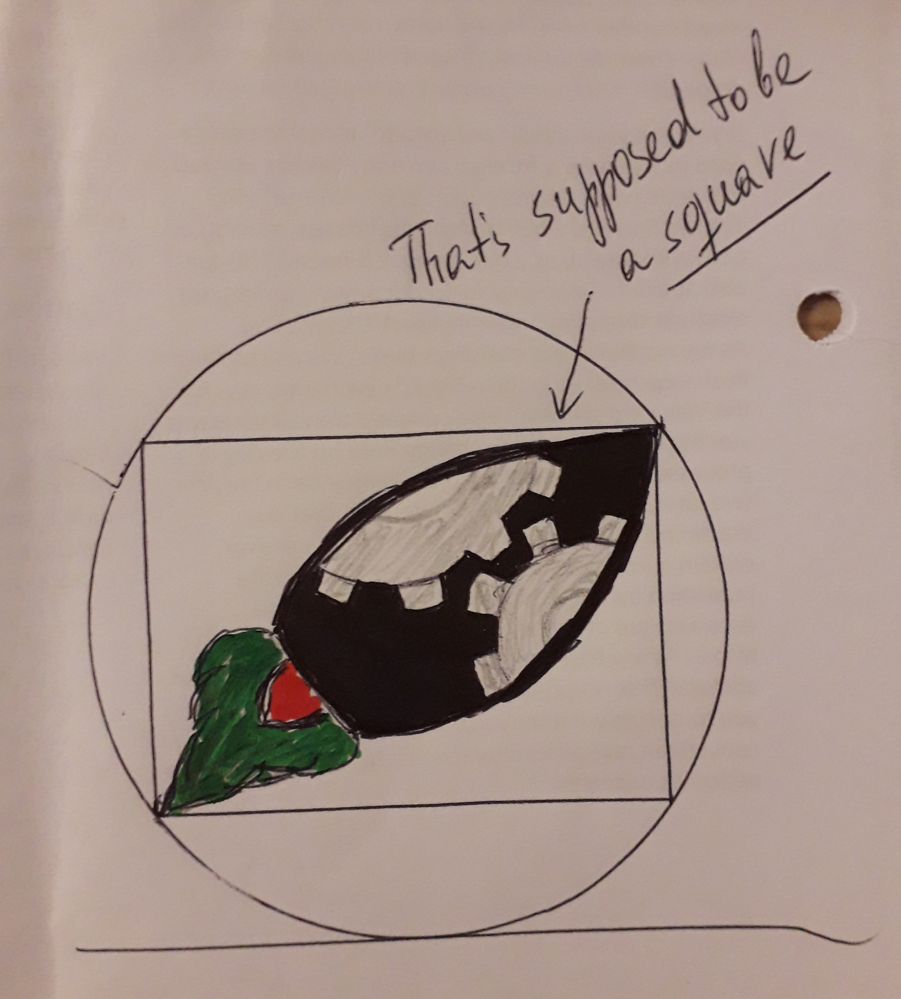

Logo specs
=== 

Design Title: 
---
Simple logo (see full, professional list of specs + sketch inside)

Description: 
--- 
The logo needs to symbolize a "project rocket" with the cogwheels inside the rocked body symbolizing a project. See the attached sketch to get a better idea.

Key points/requirements to fulfill when designing this logo: 

* rocket shape with flame and 2 halves of 2 cogwheels inside rocket body 
* orientation in a square: from the bottom left corner to the top right-hand corner (rocket nose pointing to top right)
* two halves of two interconnected cog wheels visible in the rocket body (could even be less than half of each cogwheel visible, each just needs to be recognizable as a part of a cogwheel)
* the logo needs to fit well inside a circle
* minimize the number and complexity of shapes so that when reduced to the size of a favicon (16x16px) the logo is still well recognizable i.e. keep the shapes as simple as possible
* for the same reason as above, there must be a very good contrast between the shapes
* delivery must be in a clean SVG file i.e. each shape must be on its own, properly named layer (canvas size: 500x500px)
* the cogwheels (despite being only partially visible in the rocked body) must be full cogwheels on their layers so that the logo could be animated by rotating the cogwheels on their layers which also means that the cogwheel shapes need to be circular
* colors: 
  - the rocket body should be a nice shade of blue
  - the cogwheels in the rocket body should be silver-grey 
  - the main part of the flame should be a nice shade of green
  - the small part of the flame should be red
  - the colors might need a bit of a gradient to give the logo a touch of sophistication (despite simple shapes) when viewed at full size

Note: The circle and the square in the sketch are just for reference. They are NOT part of the logo.

